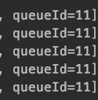

# RocketMQ实战

## 1.搭建

> 使用docker-compose

- docker-compose可以将rocketmq-console, rocketmq-nameserver，rocketmq-broker组织起来，这样降低了维护的成本

> 详细文件

- docker-compose文件

```
version: '3.5'
services:
  rmqnamesrv:
    image: foxiswho/rocketmq:server
    container_name: rmqnamesrv
    ports:
      - 9876:9876
    volumes:
      - ./data/logs:/opt/logs
      - ./data/store:/opt/store
    networks:
        rmq:
          aliases:
            - rmqnamesrv

  rmqbroker:
    image: foxiswho/rocketmq:broker
    container_name: rmqbroker
    ports:
      - 10909:10909
      - 10911:10911
    volumes:
      - ./data/logs:/opt/logs
      - ./data/store:/opt/store
      - ./data/brokerconf:/etc/rocketmq
    environment:
        NAMESRV_ADDR: "rmqnamesrv:9876"
        JAVA_OPTS: " -Duser.home=/opt"
        JAVA_OPT_EXT: "-server -Xms128m -Xmx128m -Xmn128m"
    command: mqbroker -c /etc/rocketmq/broker.conf
    depends_on:
      - rmqnamesrv
    networks:
      rmq:
        aliases:
          - rmqbroker

  rmqconsole:
    image: styletang/rocketmq-console-ng
    container_name: rmqconsole
    ports:
      - 8080:8080
    environment:
        JAVA_OPTS: "-Drocketmq.namesrv.addr=rmqnamesrv:9876 -Dcom.rocketmq.sendMessageWithVIPChannel=false"
    depends_on:
      - rmqnamesrv
    networks:
      rmq:
        aliases:
          - rmqconsole

networks:
  rmq:
    name: rmq
    driver: bridge
```


- broker.conf文件

```
brokerClusterName=hammy-broker-cluster
brokerName=hammy-broker
brokerId=0
# 修改为你宿主机的 IP
# 这个很有讲究 如果是正式环境 这里一定要填写内网地址（安全）
# 如果是用于测试或者本地这里建议要填外网地址,因为你的本地代码是无法连接到阿里云内网,只能连接外网
brokerIP1=192.168.1.5
defaultTopicQueueNums=4
autoCreateTopicEnable=true
autoCreateSubscriptionGroup=true
# Broker 对外服务的监听端口,
listenPort=10911
deleteWhen=04
# 文件回收120h
fileReservedTime=120
mapedFileSizeCommitLog=1073741824
mapedFileSizeConsumeQueue=300000
diskMaxUsedSpaceRatio=88
maxMessageSize=65536
# Broker角色
# - ASYNC_MASTER 异步复制Master
# - SYNC_MASTER 同步双写Master
# - SLAVE
brokerRole=ASYNC_MASTER
# 刷盘方式
# - ASYNC_FLUSH 异步刷盘
# - SYNC_FLUSH 同步刷盘
flushDiskType=ASYNC_FLUSH
```

## 2.生产者

> RockerMQTemplate

- SpringBoot提供的mq模板类,主要用于消息的发送

> 重要参数

- sendMessageTimeout:默认超时时间3s
- 发生失败后重试次数：2
- 消息体最大:4MB

> 同步发送

- 同步发送，会接受到一个sendResult,这个sendResult由broker发送
- 可以根据sendResult的状态，来观察本次发送的结果

```
@Slf4j
@Component
public class Producer {

    @Value("${rocketmq.topic.name}")
    private String topic;

    @Autowired
    private RocketMQTemplate mqTemplate;

    public void sendMsg(String msg, String msgId) {
        SendResult sendResult = mqTemplate.syncSend(topic, MessageBuilder.withPayload(msg)
                .setHeader(RocketMQHeaders.KEYS, msgId)
                .setHeader(MessageHeaders.CONTENT_TYPE, MimeTypeUtils.APPLICATION_JSON_VALUE)
                .build());

        log.info("sendResult:[{}]", sendResult);
    }
    
}
```

> SendResult

```
public enum SendStatus {
    SEND_OK,
    FLUSH_DISK_TIMEOUT,
    FLUSH_SLAVE_TIMEOUT,
    SLAVE_NOT_AVAILABLE,
}
```

> 异步发送

- 异步发送将当前请求使用线程池进行submitWorks,发送端通过CallBank()对结果进行有效地监听

```  
public void asyncSend(String msg, String msgId) {
        mqTemplate.asyncSend(topic, MessageBuilder.withPayload(msg)
                .setHeader(RocketMQHeaders.KEYS, msgId)
                .setHeader(MessageHeaders.CONTENT_TYPE, MimeTypeUtils.APPLICATION_JSON_VALUE)
                .build(), new SendCallback() {
            @Override
            public void onSuccess(SendResult sendResult) {
                log.info("sendResult:[{}]", sendResult);
            }

            @Override
            public void onException(Throwable e) {
                log.info("exception:[{}]", e.getMessage());
            }
        });
    }
```

> 顺序发送

- 顺序发送包含同步和异步,在RocketMQ中可以使用sendOrderly实现，sendOrderly需要传入一个参数hashKey
这个参数用来选择发送的MessageQueue,如果是相同的hashCode那么就会发送到相同的队列中
  


- 根据打印的SendResult结果来看，发送的消息都在一个Queue中

```
  public void sendOrderly(String msg, String msgId) {
        SendResult sendResult = mqTemplate.syncSendOrderly(topic, MessageBuilder.withPayload(msg)
                .setHeader(RocketMQHeaders.KEYS, msgId)
                .setHeader(MessageHeaders.CONTENT_TYPE, MimeTypeUtils.APPLICATION_JSON_VALUE)
                .build(), Objects.hashCode(msg) + "");

        log.info("sendResult:[{}]", sendResult);
    }
```

> 单向发送

- 单向发送的特点是不接受SendResult，如果对于这种不敏感不需要确认状态的消息可以使用sendOneWay


## 3.消费者

> console配置参数

- consumeEnable:允许消费
- consumeBroadcastEnable:允许开启广播模式
- retryQueueNums:重试队列数量

> RocketMQMessageListener

- 在SpringBoot中使用@RocketMQMessageListener注解实现对MQ的控制，实际上是对DefaultMQPushConsumer
包装了一层.
- 消费模式:默认是并发消费，可选顺序消费
- 消费模型:集群消费，广播消费(广播消费对应所有的订阅者，都可以收到消息。集群则是仅有一个消费者消费)
- ConsumeFromWhere:指定消费位置，LAST_OFFSET,FIRST_OFFSET,TIMESTAMP（指定时间戳
- 通过RocketMQPushConsumerLifecycleListener可以实现对consumer的一些设置(prepareStart)

> DefaultLitePullConsumer 

- 可以使用这个类实现对消息的Pull模式

> 批量消费设置参数 

- setPullInterval(拉消息间隔)
- setConsumeThreadMin
- setConsumeThreadMax
- setConsumeMessageBatchMaxSize
- setPullBatchSize
